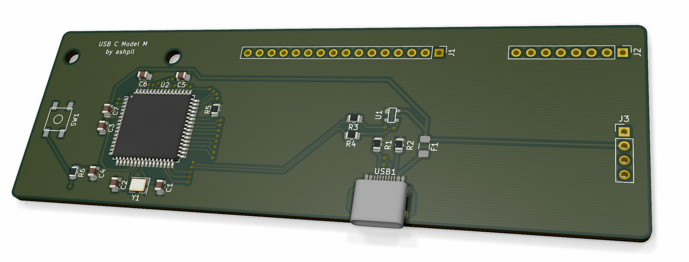

# Model M Type C
This is a project with the simple goal of recreating the old IBM Model M keyboard controller with modern technologies in mind.

## Motivation
Although the IBM Model M is perhaps the most well-known and popular of old keyboards, it isn't equipped with some modern ameneties we have grown used to enjoying. Key features that the Model M lacks are Windows and Media keys(or, broader, firmware-level repogramability), as well as a hotswappable connection with a modern interface. This controller is designed to bring 21st century features to a 20th century keyboard.

## Goals
- Native USB C
- Hotswappable
- Fully configurable with QMK compatibility
- Less power draw
- Complete reversability

## Usage
Note: If you have the Model M #1391401 (tenkeyless), see [this](https://github.com/ashpil/Model-M-Type-C-Controller/issues/2) issue.

1. Print the board either using a cheap foreign service such as [JLCPBC](https://jlcpcb.com/ "JLCPBC") for around $6 + shipping, or a domestic service such as [OSH Park](https://oshpark.com/ "OSH Park") for around $35. Someone also seems to be selling a PCB for this on eBay, which is totally a scam for $47.95. Does make me feel flattered, though.
2. Order the components- [part list](https://www.digikey.com/short/p00t8f "part list") from Digikey. USB-C port needs to be bought elsewhere, I recommend [here](https://keeb.io/products/usb-c-port-12-pin-hro-type-c-31-m-12 "usb c hro female port").  $15 total for components. If your LEDs connect via a ribbon, get [this](https://www.digikey.com/short/p012jt "this") instead of the JST 4 pin connector. I used [this](https://www.amazon.com/gp/product/B01787RB40 "usb c cable") cable as a riser cable to connect the controller's USB C port to the side of the keyboard. Unfortunately, due to size conflicts, this cannot be done without a riser cable if you want the external usb c cable to be detachable. This brings total component cost to $25 without shipping.
3. Put it together. It's possible to solder these SMD components manually with a soldering iron, but if you are able to find a hot air gun or a reflow oven, it'll be significantly easier. Reference the visual BOM to see what goes where.
4. 3D print the [USB-C cable dock](usbcdock.stl "usb c dock"). You can mount this on top of the board for it to look near-native. Attach the riser cable to the dock with some hot glue or epoxy.
4. Connect the ribbon cables and LED wires, and mount the PCB in the same way the old PCB was mounted. Attach the USB-C dock on top of that.
5. Install firmware.

## Firmware
This board is fully compatible with QMK. This is a default QMK configuration, so all you need to do is run this from your QMK directory when you are ready:

	make ashpil/modelm_usbc:default:flash
	
Check [here](https://github.com/qmk/qmk_firmware/tree/master/keyboards/ashpil/modelm_usbc "QMK profile") for details.

## Other

If you have any problems/comments, or find anything that could be improved, please submit issue or a pull request!
